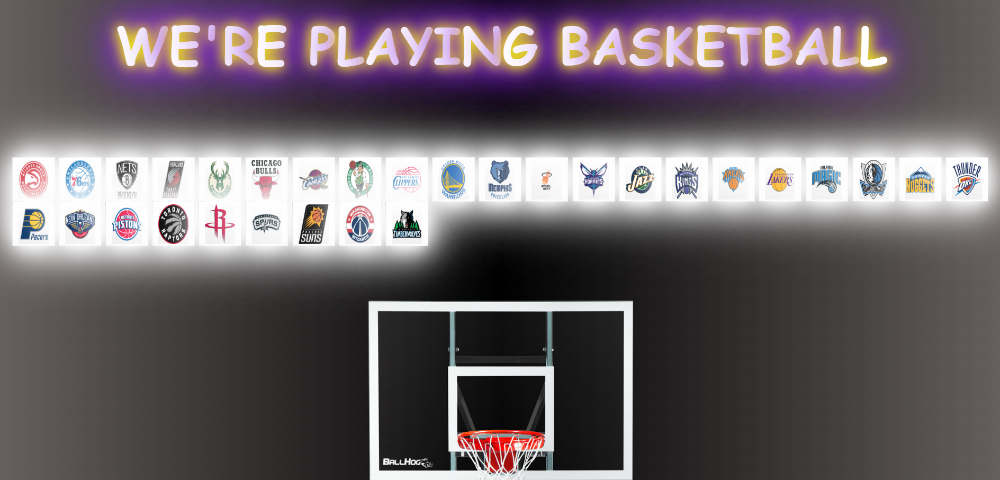
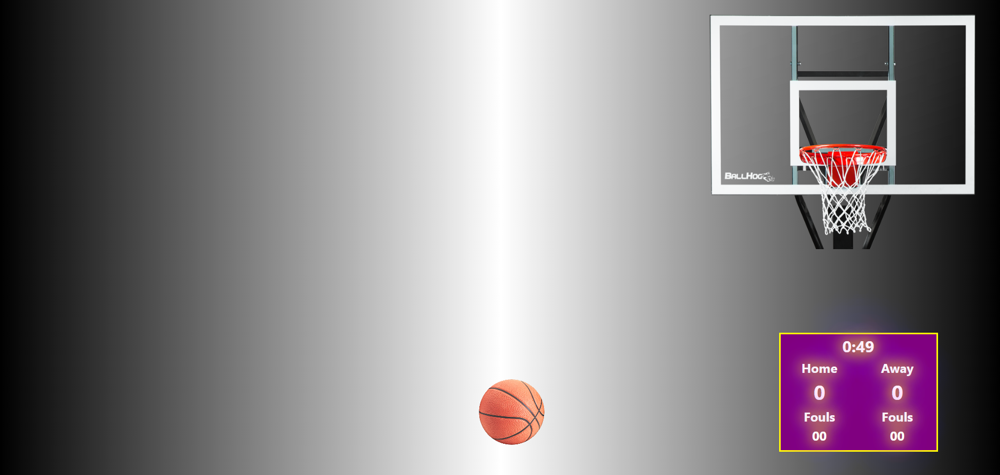

# THE LEAGUE

The purpose of this application is for users who want to play with their favorite players on their team. Or for users who just want to relax and play some games.The first page will show a roster of teams. Pick five players from any team. Once five players are picked, you will be directed to a game where you try to do as many free throws as you can. What you will see in this application is an unfinished product of the application. There is till more work that needs to be done. 

# Dependencies
Back-End
npm install nba
npm install mysql2
npm init
npm sequelize-CLI
npm install:init
heroku create
npm express
npm express-handlebars

Front-End
API-NBA

# Files
The Files that are contained in this project is a config folder containing a config.json file. This file connects to Heroku. The next folder is a DB(Database folder) that connects to the Mysql database. Next is the models foolder which contains the index.js, players.js, and teamplayer.js files. These files are going to render information from the Mysql database. Next is the public folder containing the js, css, and index.html, and game.html files.Last is our server.js files. 

